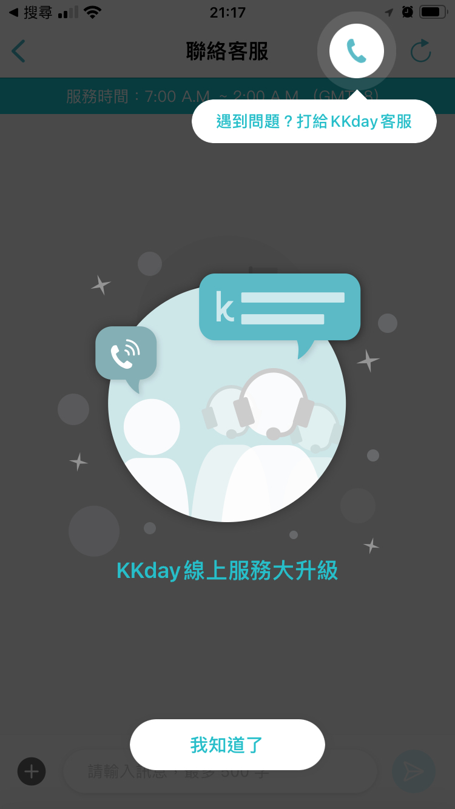
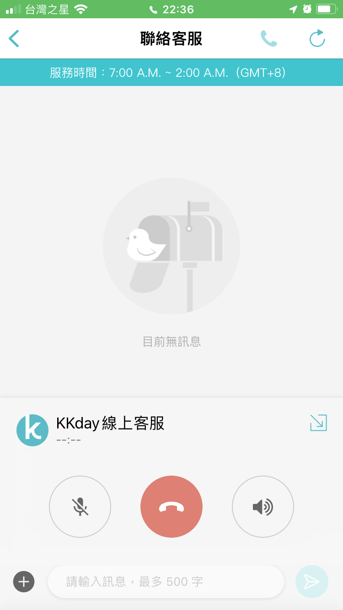
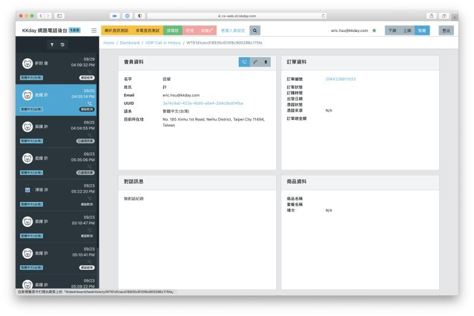

## Story

About 3 years ago, I was in KKday and we've achieved a big milestone, which is the very first launch of KKday iOS/Android App, it's extremely hard works in that 3 months.

Our customers were using simplified payment flows on App with function limitations, if anything went wrong, all they can do, is to send feedback mail to us, or dial out to our emergency phone number. 

Unfortunately, most of our users were travelers in foreign countries, it's difficult to call for help by phone.

As the result, App PM (Sherry Shih) comes to mobile team and discuss with me. How can we provide some **voice service like Line or WhatsApp** for our customer, and for **free**.

In the end, we decided to build up a VoIP service inside KKday App, that's free and easy to talk to our agents in real time, like Line or WhatsApp.

## Requirements

- As users, they can call to voice agents via KKday App. It will automatically route to most capable agents by regions / languages / time zone
- As agents, they can join the work queues when they are available, and preview the customer details before pick-up the calls.
- As manager, he/she will be able to check daily reports and statistic of workers

## Proposal

Since I was working on live streaming solutions at TutorABC, and our developer resources were limited at KKday then. So I was thrilled that my experience might help.

I suggested that we find some VoIP SaaS providers, such as Twilio / Agora / Nexmo, and do a quick survey for pros and cons. After technical estimation in 1 week, we start to plan for POC.

And the goal should look like screenshots below:

|                 Free VoIP calls in KKday App                 |               Call Center Web for KKday agents               |
| :----------------------------------------------------------: | :----------------------------------------------------------: |
|  |  |

## Challenges

### Phase 1 - Build up a POC

PM and I started to talk to some key stakeholders, e.g.,

- Customer service leader of South East Asia - requested 2 agents for testing
- DevOps lead - allocated NodeJS server and DB for SaaS integration
- Mobile lead (CTO) - 1 App QA + 1 Full stack developer (me)

1 month later, we started to ship the first working build (iOS + NodeJS + ReacJS) to QA and internel testers 

### Phase 2 - Training & Testing

- PM and I write down user guide and troubleshooting documents for agents; setup meetings to collect feedbacks
- I invited Android / iOS developers to fix bugs, introduced SaaS workflow and debugging skills. There are bunch of problems, e.g. China privacy policy, push notification issues, network issues, blah blah....
- Create demos for CEO / CTO / team members, to make sure everybody is on the same page for this project

### Phase 3 - Maintain & Scale-up

This project finally went production phase in 2 months, however, there are still lots of work to do, e.g.,

- Scalability - how to make the service scalable, 30 agents to 300 agents, even 3000 agents around the globe.
- Flexibility - how to integrate with other KKday eco-system, e.g. in-house supply chain vendors, affiliate vendors, and etc.
- Stability - how to keep new features stable, e.g. more rich-content reports, more configurable worker flow.

So I became an interviewer to find someone who is good at micro-service as backend developer, and front-end developer who is capable to optimize UX/UI feature for CRM system.

Fotunately, we found good team members in few months, and those services still worked so far. 

## Behind the scene

In those old times, I was very glad to work with PM, CS agents, QA and related colleagues, and learned a lot. Team works makes my life more delightful, and drive me solve more problems for our customers. 

It's not only codes and bugs, but also thoughts and passions. I always love to "eat my own dog food," so that I can build a better product for world.

Cheers.